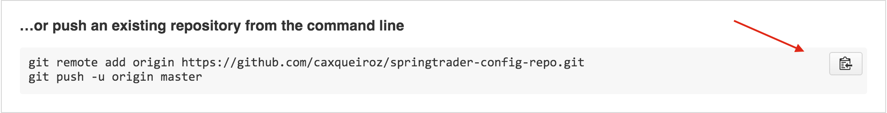
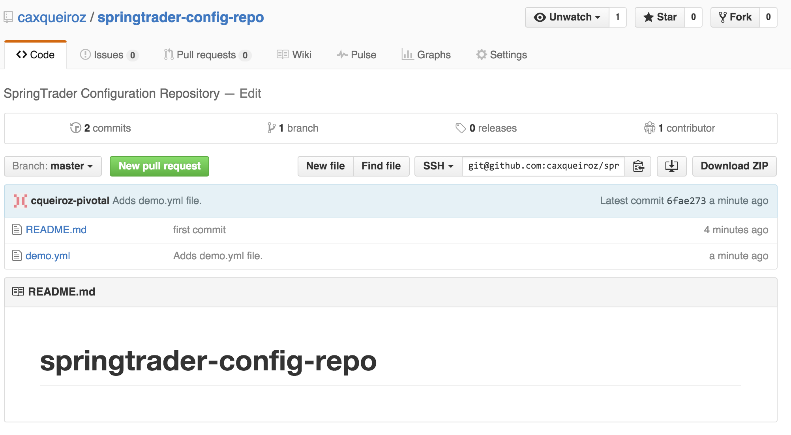

= Lab 14 - Deploying and Using Spring Cloud Config Server

Estimated time to complete: 45 minutes
[abstract]
--
Now we'll begin using the components found in Spring Cloud to implement patterns for distributed systems.
We'll being using Spring Cloud Config to centralize configuration for applications.
Our configuration will be stored in a GitHub repository, and served to our applications using the Spring Cloud Config Server.

In this lab, we'll do the following:

. Create a GitHub repository to store our configuration
. Create a Spring Cloud Config Server and test it with a basic sample application
. (Optional) Only if you have time, deploy the Config Server to Pivotal Cloud Foundry
. (Optional) Update our previously developed microservices to source their configuration from the Config Server
--

== Create a GitHub repository to Store Configuration

. Change to the lab directory:
+
----
$ cd $COURSE_HOME/day_02/session_06/lab_14/initial
----

. Create a directory for the configuration repo:
+
----
$ mkdir config-repo && cd config-repo
----

. Initialize the Git repository:
+
----
$ git init
----

. In the repo, create the file `demo.yml`, and into that file paste the following:
+
----
greeting: Hello
----

. Stage your changes and commit them:
+
----
git add . && git commit -m "initial commit"
----

. Make sure you're logged in to your GitHub account, and create a new repository:
+
image::../../../Common/images/github_1.png[]

. Give the repo a name and description, and then click ``Create repository'':
+
image::../../../Common/images/github_2.png[]

. Paste the commands from ``...push an existing repository...'' to the command prompt and execute them:
+

+
----
$ git remote add origin https://github.com/caxqueiroz/springtrader-config-repo.git
$ git push -u origin master
Counting objects: 3, done.
Delta compression using up to 4 threads.
Compressing objects: 100% (2/2), done.
Writing objects: 100% (3/3), 303 bytes | 0 bytes/s, done.
Total 3 (delta 0), reused 0 (delta 0)
To git@github.com:caxqueiroz/springtrader-config-repo.git
   3ffd637..6fae273  master -> master
----

. Refresh the browser to see your pushed changes:
+

== Create a Spring Cloud Config Server

. Change to the lab directory:
+
----
$ cd $COURSE_HOME/day_02/session_06/lab_14/initial/springtrader-config-server
----
+
and import the project (via `pom.xml`) into your IDE of choice.

. Open `pom.xml`, change the parent POM to the `spring-cloud-starter-parent`:
+
----
<parent>
  <groupId>org.springframework.cloud</groupId>
  <artifactId>spring-cloud-starter-parent</artifactId>
  <version>1.0.2.RELEASE</version>
  <relativePath/>
  <!-- lookup parent from repository -->
</parent>
----

. Change the dependency on `spring-boot-starter` to `spring-cloud-starter`:
+
----
<dependency>
  <groupId>org.springframework.cloud</groupId>
  <artifactId>spring-cloud-starter</artifactId>
</dependency>
----

. Add a dependency on `spring-cloud-config-server`:
+
----
<dependency>
  <groupId>org.springframework.cloud</groupId>
  <artifactId>spring-cloud-config-server</artifactId>
</dependency>
----

. Now open `io.springtrader.configserver.SpringtraderConfigServerApplication` and add the `@EnableConfigServer` annotation:
+
----
@SpringBootApplication
@EnableConfigServer  // <--- ADD THIS!
public class SpringtraderConfigServerApplication {

    public static void main(String[] args) {
        SpringApplication.run(SpringtraderConfigServerApplication.class, args);
    }
}
----

. Now open `src/main/resources/application.properties` and paste the following code (be sure to replace <yourUserName> with the one you created in this lab!):
+
----
server.port=8888
spring.cloud.config.server.git.uri: https://github.com/<yourUserName>/springtrader-config-repo.git
----

. Build the JAR:
+
----
$ mvn package
----

. Run the application:
+
----
$ java -jar target/springtrader-config-server-0.0.1-SNAPSHOT.jar
----

. Test the application in your web browser by connecting to http://localhost:8888/demo/default
You should be able to see your properties displayed similar to this:
+
----
{"name":"default",
 "label":"",
 "propertySources":[{"name":"https: //github.com/<yourUserName>/springtrader-config-repo.git/demo.yml",
 "source":{"greeting":"Hi there"}}]}
----
+
If you can't see `greeting` in the output your server is not working.
+
Leave the Config Server running, the client will need it.

== Create the Sample Test Application
. Change to the lab directory:
+
----
$ cd $COURSE_HOME/day_02/session_06/lab_14/initial/springtrader-config-client
----
+
and import the project (via `pom.xml`) into your IDE of choice.

. Open `pom.xml`, change the parent POM to the `spring-cloud-starter-parent`:
+
----
<parent>
  <groupId>org.springframework.cloud</groupId>
  <artifactId>spring-cloud-starter-parent</artifactId>
  <version>1.0.2.RELEASE</version>
  <relativePath/>
  <!-- lookup parent from repository -->
</parent>
----

. Add a dependency:
+
----
<dependency>
  <groupId>org.springframework.cloud</groupId>
  <artifactId>spring-cloud-starter-config</artifactId>
</dependency>
----

. In the package `io.springtrader.configclient` create the class `GreetingController`, and into that class paste the following source code:
+
----
@RestController
public class GreetingController {

    @Value("${greeting}")
    String greeting;

    @RequestMapping("/")
    public String greeter() {
        return greeting + " World!";
    }

}
----

. Create the file `src/main/resources/bootstrap.properties` and into that file paste the following:
+
----
spring.application.name=demo
----

. Build the JAR using _a new command/terminal window_ - the Config Server *must* still be running:
+
----
$ mvn package
----

. Run the application:
+
----
$ java -jar target/springtrader-config-client-0.0.1-SNAPSHOT.jar
----

. Test the application in your web browser by connecting to http://localhost:8080
You should be able to see a "Hello World" message displayed.
+
----
Hello World!
----

. Also, take a look at the Spring Environment to see how the `greeting` property is being resolved. You can connect to http://localhost:8080/env
The information you need is on the first line.
+
----
{
    "applicationConfig: [classpath:/bootstrap.properties]": {
        "spring.application.name": "demo"
    },
    "configService:https://github.com/caxqueiroz/springtrader-config-repo.git/demo.yml": {
        "greeting": "Hello"
    },

...

}
----

== (Optional) Deploy the Config Server to Cloud Foundry

. We are now going to move your Config Server to the cloud. As a first step, stop the instance of `springtrader-config-server` that was running on localhost:8888.

. You can get back to the project `springtrader-config-server`.
At the root of the project, create an application manifest in `manifest.yml` as follows:
+
[source,yml]
----
applications:
- name: springtrader-config-server
  host: springtrader-config-server-${random-word}
  memory: 512M
  instances: 1
  path: target/springtrader-config-server-0.0.1-SNAPSHOT.jar
----

. Push to Cloud Foundry:
+
----
$ cf push

...

Showing health and status for app springtrader-config-server in org pivot-cqueiroz / space development as cqueiroz@pivotal.io...
OK

requested state: started
instances: 1/1
usage: 512M x 1 instances
urls: springtrader-config-server-conservational-soloist.cfapps.pez.pivotal.io
last uploaded: Tue Jan 5 10:20:52 UTC 2016
stack: cflinuxfs2
buildpack: java-buildpack=v3.1.1-offline-https://github.com/cloudfoundry/java-buildpack#7a538fb java-main open-jdk-like-jre=1.8.0_51 open-jdk-like-memory-calculator=1.1.1_RELEASE spring-auto-reconfiguration=1.7.0_RELEASE

     state     since                    cpu    memory           disk           details
#0   running   2016-01-05 06:21:27 PM   0.0%   330.7M of 512M   147.5M of 1G
----

. Access the application on `http://springtrader-config-server-<yourAppSuffix>.cfapps.io/demo/default` to make sure everything is working properly:

+
----

{
	"name":"default",
	"label":"",
	"propertySources":
	[
		{
			"name":"https://github.com/caxqueiroz/springtrader-config-repo.git/demo.yml",
			"source":
			{
				"greeting":"Hello"
			}
		}
	]
}
----

== (Optional) Update the Microservices to Use the Config Server

. In your config repo, add the file `application.yml` and into that file paste the following:
+
----
configserver: true
----
+
We'll use the existence of this property in each of our microservices' environments to verify that the connection has been made.

. Stage, commit, and push your changes:
+
----
git add . && git commit -m "add default application config" && git push origin master
----

. Access the application again on `http://springtrader-config-server-<yourAppSuffix>.cfapps.io/demo/default` and make sure that the new property has been added

. It is now time to create a user-provided service representing the config server. You can use the `cf cups` command for that. It is a shortcut for `cf create-user-provided-service`.
+
----
$ cf cups springtrader-config-service -p '{"uri":"cf cups springtrader-config-service -p '{"uri":"http://springtrader-config-<yourAppSuffix>.cfapps.io/"}'"}'
Creating user provided service springtrader-config-service in org...
OK
----

Each of the three microservice projects has been copied into `$COURSE_HOME/day_02/session_06/lab_14/initial`, and are in the state we left them at the end of their respective labs.
You can either continue your existing projects or pickup from these copies.

For each project, perform the following steps (we'll do these once for the `springtrader-quotes` project in this guide):

. Open `pom.xml`, Add a dependency on `spring-cloud-starter-config`:
+
----
 <dependency>
     <groupId>org.springframework.cloud</groupId>
     <artifactId>spring-cloud-starter-config</artifactId>
     <version>1.0.3.RELEASE</version>
</dependency>
----

. Create the file `src/main/resources/bootstrap.yml` and into that file paste the following (provide the matching application name!):
+
----
spring:
  application:
    name: springtrader-quotes
  cloud:
    config:
      uri: ${vcap.services.springtrader-config-service.credentials.uri:http://localhost:8888}
----

. Add the `springtrader-config-service` service to the `manifest.yml` (at the root of the `springtrader-quotes` project):
+
----
---
timeout: 180
instances: 1
memory: 512M
env:
    SPRING_PROFILES_ACTIVE: cloud
    JAVA_OPTS: -Djava.security.egd=file:///dev/urandom
applications:
- name: springtrader-quotes
  random-route: true
  path: target/quotes-1.0.0-SNAPSHOT.jar
  services: [ springtrader-quotes-db, springtrader-config-service  ] # <--- Add this!
----

. Build the JAR:
+
----
$ mvn package
----

. Push the application:
+
----
$ cf push

...

Showing health and status for app springtrader-quotes in org pivot-cqueiroz / space development as cqueiroz@pivotal.io...
OK

requested state: started
instances: ?/1
usage: 512M x 1 instances
urls: springtrader-quotes-gustable-spina.cfapps.pez.pivotal.io
last uploaded: Wed Jan 6 05:18:11 UTC 2016
stack: cflinuxfs2
buildpack: java-buildpack=v3.1.1-offline-https://github.com/cloudfoundry/java-buildpack#7a538fb java-main java-opts open-jdk-like-jre=1.8.0_51 open-jdk-like-memory-calculator=1.1.1_RELEASE spring-auto-reconfiguration=1.7.0_RELEASE

     state     since                    cpu    memory           disk         details
#0   running   2016-01-06 01:18:51 PM   0.0%   406.3M of 512M   140M of 1G
----

. Access the application using `curl` to make sure the new `configserver` property exists:
+
----
$ curl -i springtrader-quotes-untrafficked-iodism.cfapps.pez.pivotal.io/env
HTTP/1.1 200 OK
Content-Type: application/json;charset=UTF-8
Date: Wed, 06 Jan 2016 06:21:56 GMT
Server: Apache-Coyote/1.1
X-Application-Context: springtrader-quotes:cloud:0
X-Cf-Requestid: 8ff3b8d5-0032-49e6-61a9-8f8b5fe27559
Connection: close
Transfer-Encoding: chunked
{

...

"configService:https://github.com/caxqueiroz/springtrader-config-repo.git/application.yml":
{
	"configserver":true
},

...

}
----
